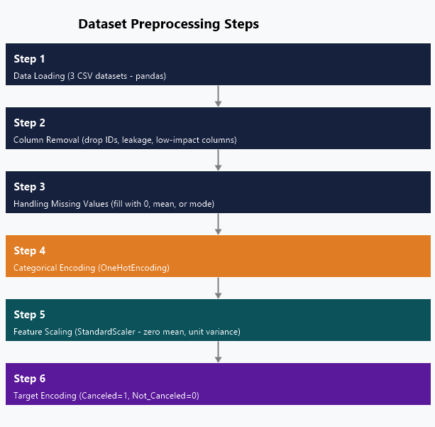
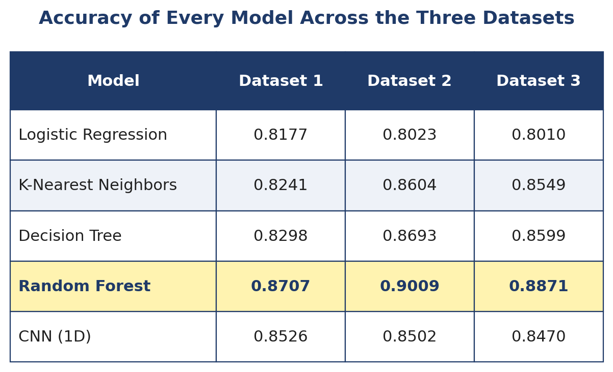

# Hotel Booking Cancellation Prediction

Predicting whether a hotel booking will be canceled, using five machine learning models trained and compared across three independent hotel datasets.


---

## Overview

Hotel booking cancellations are a costly problem for the hospitality industry. When a guest cancels late, the room often stays empty, and revenue, staffing plans and supply orders all take a hit. In some hotels cancellation rates climb above 40 percent.

This project builds and compares five classification models that predict, from booking details alone, whether a reservation will be canceled. To make sure the findings are not tied to one source of data, every model is trained and evaluated on **three separate hotel datasets** using one shared preprocessing pipeline.

**Key result:** Random Forest was the strongest model on all three datasets, reaching **87 to 90 percent accuracy**, and the ranking of the five models stayed consistent across every dataset.

---

## Table of Contents

- [Problem Statement](#problem-statement)
- [Datasets](#datasets)
- [Methodology](#methodology)
- [Algorithms](#algorithms)
- [Results](#results)
- [Repository Structure](#repository-structure)
- [How to Run](#how-to-run)
- [Tech Stack](#tech-stack)
- [Research Paper and Presentation](#research-paper-and-presentation)
- [Authors](#authors)
- [License](#license)

---

## Problem Statement

Cancellation behavior depends on many interacting factors such as how far in advance the booking was made, the deposit type, the market segment and the number of special requests. Simple rules and historical averages cannot capture these interactions well, which leads to inaccurate forecasts and either costly overbooking or lost revenue.

The goal of this project is to answer one question: **which machine learning model predicts hotel cancellations most reliably on tabular booking data, and does that answer hold across different hotels?**

---

## Datasets

Three hotel booking datasets were used so the results could be tested for consistency rather than fitted to a single source.

| Dataset | Description | Records | Features | Target |
|---------|-------------|---------|----------|--------|
| Dataset 1 | Resort hotels (Indian cities) | 119,390 | 33 | `canceled` |
| Dataset 2 | Inn hotel chain | 36,275 | 19 | `booking_status` |
| Dataset 3 | Inn hotel chain (renamed variant) | 36,285 | 17 | `booking status` |

All three share common predictors such as lead time, room type, market segment and special requests. Roughly one third of the bookings in each dataset are cancellations, so the target is moderately imbalanced.

> The CSV files are included in the [`data/`](data/) folder. They originate from publicly available hotel booking datasets on Kaggle. See [`data/README.md`](data/README.md) for the source links.

---

## Methodology

The same pipeline runs on all three datasets, which is what makes the cross dataset comparison fair.

1. **Data loading** — read each CSV with pandas.
2. **Column removal** — drop identifiers, leakage columns (such as `reservation_status`) and low value columns.
3. **Handling missing values** — numeric columns filled with the training mean, categorical columns with the training mode.
4. **Categorical encoding** — one hot encoding fit on the training split only.
5. **Feature scaling** — `StandardScaler` applied to numeric features, fit on the training split only.
6. **Target encoding** — `Canceled` mapped to 1, `Not_Canceled` to 0.

Each dataset is split 80 percent for training and 20 percent for testing with a fixed random seed for reproducibility.



Exploratory plots for every dataset are in [`figures/eda/`](figures/eda/). The clearest pattern is lead time: canceled bookings consistently show a much higher median lead time than bookings that go through.

---

## Algorithms

Five models were chosen on purpose to cover a range of learning styles.

| Model | Type | Why it was included |
|-------|------|---------------------|
| Logistic Regression | Linear baseline | Sanity baseline for the other models |
| K-Nearest Neighbors | Distance based | Tests whether similar bookings cluster after scaling |
| Decision Tree | Single tree | Captures non-linear feature interactions |
| Random Forest | Tree ensemble | Robust to overfitting and high dimensionality |
| 1D CNN | Deep learning | Tests whether a neural network beats tree models on tabular data |

Every model was evaluated with accuracy, precision, recall and F1 score, plus a confusion matrix.

---

## Results

Random Forest came out on top on every dataset. Logistic Regression was consistently the weakest. The CNN landed in the middle, which confirms that tree based ensembles are better suited to tabular booking data than a convolutional network.

### Accuracy across all datasets

| Model | Dataset 1 | Dataset 2 | Dataset 3 |
|-------|:---------:|:---------:|:---------:|
| Logistic Regression | 0.8177 | 0.8023 | 0.8010 |
| K-Nearest Neighbors | 0.8241 | 0.8604 | 0.8549 |
| Decision Tree | 0.8298 | 0.8693 | 0.8599 |
| **Random Forest** | **0.8707** | **0.9009** | **0.8871** |
| 1D CNN | 0.8526 | 0.8502 | 0.8470 |



Per dataset metric tables and all fifteen confusion matrices are in the [`results/`](results/) folder.

### Takeaways

- Random Forest is the most reliable choice for this problem, with the highest accuracy and F1 on the canceled class.
- The model ranking did not change across three independent datasets, which makes the conclusion trustworthy.
- The CNN underperformed because the convolutional bias assumes spatial structure in features, which tabular data does not have.
- Even the best model missed roughly 20 percent of real cancellations, so class imbalance is the main target for future work.

---

## Repository Structure

```
hotel-booking-cancellation-prediction/
├── notebook/
│   └── Hotel_Cancellation_Prediction.ipynb   # full analysis pipeline
├── data/
│   ├── dataset_1_indian_resort_hotels.csv
│   ├── dataset_2_inn_hotel.csv
│   └── dataset_3_inn_hotel_variant.csv
├── results/
│   ├── summary_all_models.png
│   ├── tables/                               # per dataset metric tables
│   ├── dataset_1/                            # 5 confusion matrices
│   ├── dataset_2/
│   └── dataset_3/
├── figures/
│   ├── methodology_flowchart.png
│   ├── preprocessing_steps.png
│   └── eda/                                  # exploratory plots
├── docs/
│   ├── research_paper.pdf                    # full IEEE style paper
│   └── presentation.pptx                     # project slides
├── requirements.txt
├── LICENSE
└── README.md
```

---

## How to Run

1. Clone the repository.

   ```bash
   git clone https://github.com/<your-github-username>/hotel-booking-cancellation-prediction.git
   cd hotel-booking-cancellation-prediction
   ```

2. Install the dependencies.

   ```bash
   pip install -r requirements.txt
   ```

3. Open the notebook.

   ```bash
   jupyter notebook notebook/Hotel_Cancellation_Prediction.ipynb
   ```

The notebook was originally developed in Google Colab. If you run it there, upload the three CSV files from the `data/` folder and adjust the file paths in the loading cells.

---

## Tech Stack

- **Python** — pandas, NumPy
- **scikit-learn** — Logistic Regression, KNN, Decision Tree, Random Forest, preprocessing, metrics
- **TensorFlow / Keras** — 1D Convolutional Neural Network
- **Matplotlib, Seaborn** — visualization
- **Jupyter / Google Colab** — development environment

---

## Research Paper and Presentation

This project was also written up as a full research paper and presented as a slide deck.

- [Research Paper (PDF)](docs/research_paper.pdf) — IEEE style paper covering abstract, related work, methodology, results and conclusion.
- [Presentation (PPTX)](docs/presentation.pptx) — 19 slide deck summarizing the project.

---

## Authors

**Team 32 — Faculty of Computer Science, Misr International University, Cairo, Egypt**

- Ali Hassan Sulaiman (Team Leader)
- Mohamed Waleed Galal
- Omar Hassan Mostafa
- Zyad Tarek Mohamed

---

## License

This project is released under the MIT License. See the [LICENSE](LICENSE) file for details.
